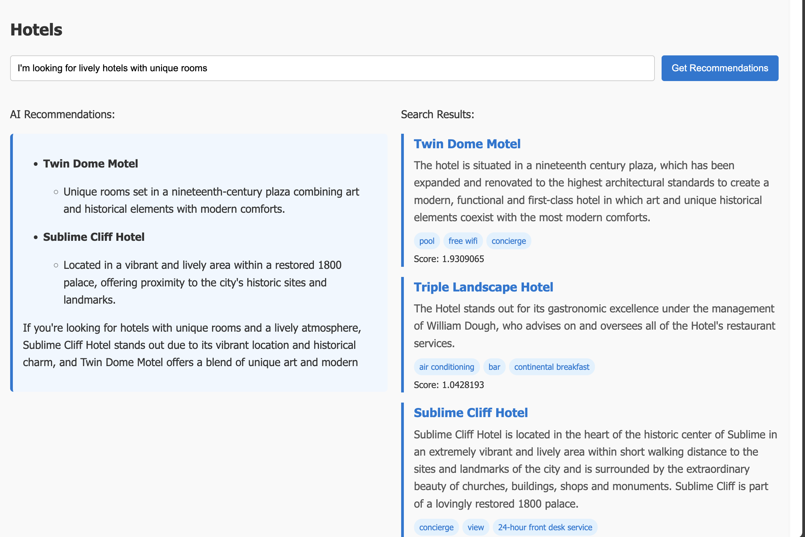

# azd-compose-search-demo

`azd-compose-search-demo` is a simple RAG app built using [aka.ms/azd-compose](https://aka.ms/azd-compose), which lets users progressively compose the Azure resources required for their app without manually writing Bicep.

This app uses Azure OpenAI, Azure Container Apps, and Azure AI Search (non-vector index).



## Prerequisites

- [Azure Developer CLI (azd)](https://learn.microsoft.com/azure/developer/azure-developer-cli/install-azd)
- Azure subscription with access to:
  - Azure OpenAI
  - Azure AI Search
  - Azure Container Apps
- Docker
- Python 3

## Getting Started

### 1. Initialize the project

> [!IMPORTANT]
> Since these features are currently in alpha, make sure to enable the feature flags using the following commands:
> ```sh
> azd config set alpha.compose on
> azd config set alpha.infraSynth on
> ```

1. Clone the repository:
   ```sh
   git clone https://github.com/JeffreyCA/azd-compose-search-demo.git
   cd azd-compose-search-demo
   ```

2. Initialize project:
   ```sh
   azd init
   ```
   
   **? How do you want to initialize your app?** `Use code in the current directory`  
   **? Select an option** `Confirm and continue initializing my app`

   It should generate an `azure.yaml` and `next-steps.md` file.

> [!NOTE]
> For reference, we've included an `azure.yaml.example` file that shows the final configuration after adding all resources.

3. Deploy web app:
   ```sh
   azd up
   ```

> [!TIP]
> Instead of `git clone` followed by `azd init`, you can also set up your project by running `azd init -t JeffreyCA/azd-compose-search-demo`, which automatically clones the repository and initializes the project with an empty `azure.yaml`.  
>
> However, you'll need to `azd add` the Azure Container App host yourself:
>
> ```sh
> azd add
> ```
> **? What would you like to add?** `Host service`  
> **? Where is your app code project located?** `api`  
> **? Enter a name for this service:** `api`  
> **? azd will use Azure Container App to host this project. Continue?** `Yes`

### 2. Progressively `azd add` resources

1. Add Azure AI Search:
   ```sh
   azd add
   ```

   **? What would you like to add?** `AI`  
   **? Which type of AI resource?** `Azure AI Search`  
   **? Select the service(s) that uses this resource:** `api` (press `space` to select)  
   **? Accept changes to azure.yaml? (Y/n)** `Y`  
   **? Do you want to provision these changes?** `Yes (preview changes)/Yes`  
   **? Provision these changes to Azure? (Y/n)** `Y`

   The app should be deployed with basic search functionality.

2. Add Azure OpenAI model:
   ```sh
   azd add
   ```

   **? What would you like to add?** `AI`  
   **? Which type of AI resource?** `Azure OpenAI model`  
   **? Which type of Azure OpenAI service?** `Chat (GPT)`  
   **? Select the model** `gpt-4o (any version)`  
   **? Provide a name for this model** `gpt-4o`  
   **? Select the service(s) that uses this resource:** `api` (press `space` to select)  
   **? Accept changes to azure.yaml? (Y/n)** `Y`  
   **? Do you want to provision these changes?** `Yes (preview changes)/Yes`  
   **? Provision these changes to Azure? (Y/n)** `Y`

   This enables the full RAG capabilities with AI-powered responses.

> [!TIP]
> If provisioning fails due to `InsufficientQuota`, follow the instructions in the [Troubleshooting](#troubleshooting) section.

> [!TIP]
> You can try adding other OpenAI models. Make sure to update the model name in `api/app.py`.

### 3. Set up search index
There are some one-time scripts in `scripts` directory needed to initialize and populate the search index.

1. Get Azure AI Search endpoint info:
   ```sh
   azd show search
   ```

    You should see something like:
    ```
    search (Search service)
      Variables:
        AZURE_AI_SEARCH_ENDPOINT=https://srch-XXXXXX.search.windows.net
    ```

2. Create the index:
   ```sh
   # Unix
   AZURE_AI_SEARCH_ENDPOINT=https://srch-XXXXXX.search.windows.net python scripts/create-index.py

   # Windows
   set "AZURE_AI_SEARCH_ENDPOINT=https://srch-XXXXXX.search.windows.net" && python scripts/create-index.py
   ```

   If successful, it should print "**hotels-quickstart created**".

3. Upload sample documents:
   ```sh
   # Unix
   AZURE_AI_SEARCH_ENDPOINT=https://srch-XXXXXX.search.windows.net python scripts/upload-documents.py

   # Windows
   set "AZURE_AI_SEARCH_ENDPOINT=https://srch-XXXXXX.search.windows.net" && python scripts/upload-documents.py
   ```

   If successful, it should print "**Uploaded 4 documents**".

### 4. Use the app

Navigate to the Container App URL (run `azd show`) and try out some queries. Examples:

- Can you recommend a hotel with complimentary breakfast?
- I'm looking for lively hotels with unique rooms.

## Troubleshooting

### Insufficient OpenAI Quota

If deployment fails with an error like:
```
ERROR: error executing step command 'provision': deployment failed: error deploying infrastructure
InsufficientQuota: This operation require 20 new capacity in quota Tokens Per Minute (thousands) - gpt-4o, which is bigger than the current available capacity X.
```

Follow these steps:

1. Generate the infrastructure code:
   ```sh
   azd infra synth
   ```

2. Edit `infra/resources.bicep` and locate the OpenAI account deployment. Adjust the `capacity` value to match your quota limits:
   ```bicep
   deployments: [
     {
       name: 'gpt-4o'
       model: {
         format: 'OpenAI'
         name: 'gpt-4o'
         version: '2024-08-06'
       }
       sku: {
         capacity: 20  # Adjust this value
         name: 'Standard'
       }
     }
   ]
   ```

3. Retry the deployment:
   ```sh
   azd up
   ```

## References
- [Azure Developer CLI Compose](https://learn.microsoft.com/azure/developer/azure-developer-cli/azd-compose)
- [Quickstart: Generative search (RAG)](https://learn.microsoft.com/azure/search/search-get-started-rag)
- [Quickstart: Full text search](https://learn.microsoft.com/azure/search/search-get-started-text)
- [RAG Quickstart for Azure AI Search (ipynb)](https://github.com/Azure-Samples/azure-search-python-samples/blob/main/Quickstart-RAG/Quickstart-rag.ipynb)
- [Azure AI Search Quickstart (ipynb)](https://github.com/Azure-Samples/azure-search-python-samples/blob/main/Quickstart/azure-search-quickstart.ipynb)
